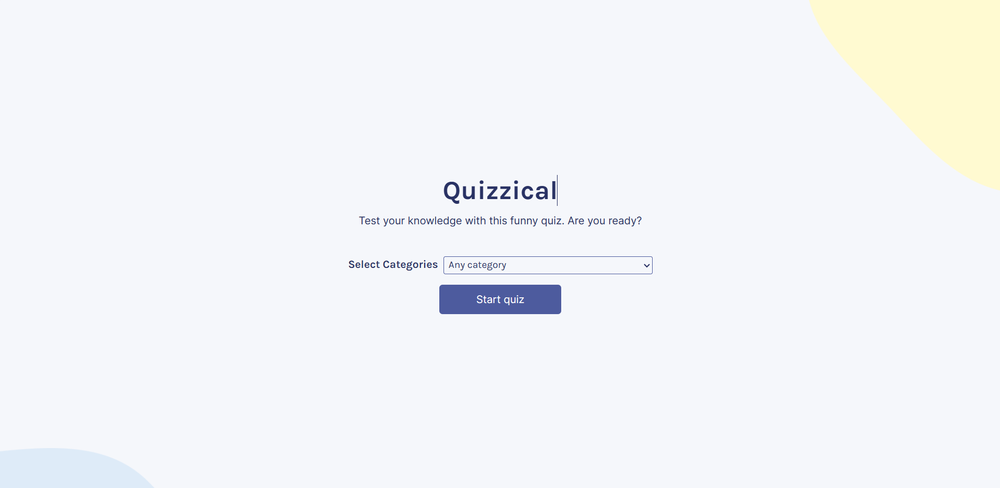

# Quizzical Quiz

Welcome to Quizzical Quiz, a web application developed with React to test your trivia knowledge!

This project was created as part of my learning in web development and React. It features a variety of trivia questions in different categories, allowing users to test their knowledge and enjoy an interactive experience.

I used Open Trivia DB API request to retrieve the questions and answers.

## How to access Quizzical Quiz

You can access Quizzical Quiz by clicking on the link below:

[Quizzical Quiz](https://robertoalyssom.github.io/quizzical-trivia/)

Feel free to try it out and share your performance!

## Features

- User-friendly and responsive interface.
- Different categories of questions to choose from.
- Instant feedback on correct and incorrect answers.

## Technologies used

- React
- HTML
- CSS
- JavaScript

## How to run locally

If you want to run Quizzical Quiz on your local environment, follow these steps:

1. Clone this repository to your local machine.
2. Navigate to the project directory.
3. Run `npm install` to install the dependencies.
4. Run `npm start` to start the development server.
5. Open your browser and go to `http://localhost:3000`.

## Contributions

Contributions are welcome! If you find bugs, have feature suggestions, or improvements, feel free to open an issue or submit a pull request.

## Author

This project was developed by [Roberto Alyssom](https://github.com/robertoalyssom).

---

Enjoy and good luck on Quizzical Quiz!
